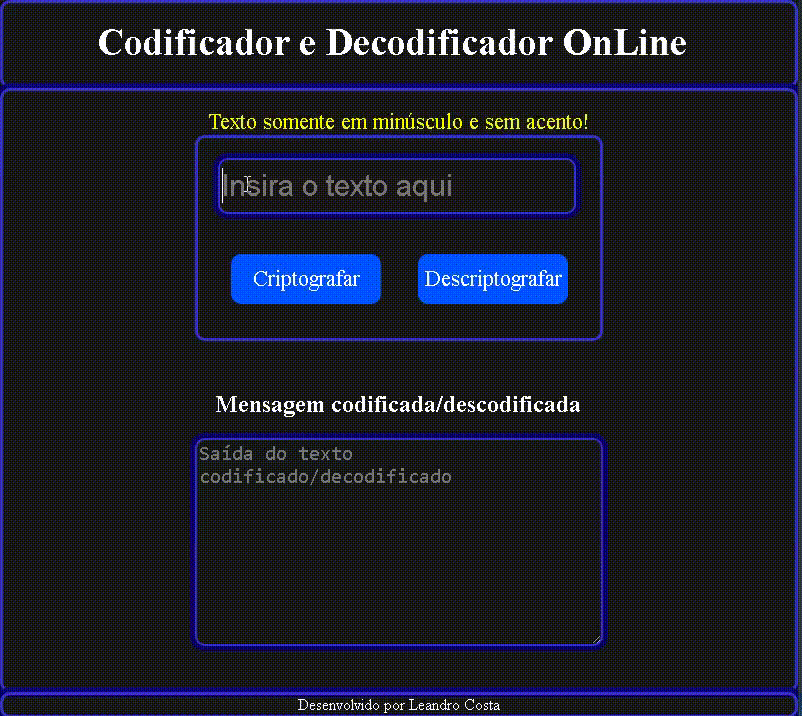

# Challenge-Oracle-ONE

## 👨‍🎓 Desafio do curso Lógica de programação

## 👀 Sobre
Challenge Oracle ONE - Lógica de Programação - Semana 01 e 02. Desenvolver um **codificador/decodificador** de texto com Javascript.

## 🛠 Tecnologias
- HTML
- CSS
- Javascript

### 🐱‍🏍 Leandro Costa - "Sempre em busca do conhecimento!"
